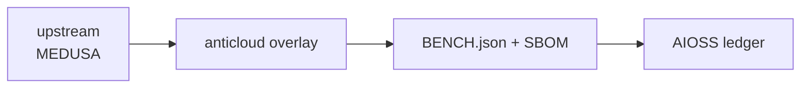

# MEDUSA (Anticloud overlay)
  
**Upstream:** UNMEASURED @ `UNMEASURED`
**Category:** CLOTHING_RETAIL
## Benchmarks (measured, with provenance)
Figures below come ONLY from `BENCH.json` (run stamp inside that file).
```json
{
  "schema": "anticloud.tier-bench/1",
  "project": "MEDUSA",
  "source": {
    "repo_path": "E:\\fenta\\Downloads\\The Anticloud\\ANTICLOUD_REPOS\\CLOTHING_RETAIL\\MEDUSA\\UPSTREAM_CLONE",
    "git": {
      "head": "",
      "url": "https://github.com/the-anticloud/OPENMRS_CORE.git",
      "branch": "master",
      "committed_at": "2026-09-29T11:06:59+04:00"
    }
  },
  "metrics": {
    "files_total": 703,
    "source_files_scanned": 626,
    "lines_of_code": 152508,
    "languages": {
      ".ts": 472,
      ".tsx": 126,
      ".js": 25,
      ".md": 20,
      ".json": 20,
      "(none)": 12,
      ".csv": 10,
      ".cjs": 5,
      ".ttf": 4,
      ".sh": 3,
      ".ini": 1,
      ".yml": 1,
      ".html": 1,
      ".svg": 1,
      ".mjs": 1
    }
  },
  "licence": {
    "spdx": "MIT",
    "class": "A",
    "source_file": "LICENSE",
    "redistribution_allowed": true
  },
  "dependencies": {
    "count": 270,
    "unique": 195,
    "by_ecosystem": {
      "npm": 270
    },
    "list": [
      {
        "ecosystem": "npm",
        "name": "@changesets/changelog-github",
        "version": "^0.4.8",
        "source_file": "package.json",
        "raw": ""
      },
      {
        "ecosystem": "npm",
        "name": "@changesets/cli",
        "version": "^2.26.0",
        "source_file": "package.json",
        "raw": ""
      },
      {
        "ecosystem": "npm",
        "name": "import-from",
        "version": "^3.0.0",
        "source_file": "package.json",
        "raw": ""
      },
      {
        "ecosystem": "npm",
        "name": "@atomico/rollup-plugin-sizes",
        "version": "^1.1.4",
        "source_file": "package.json",
        "raw": ""
      },
      {
        "ecosystem": "npm",
        "name": "@faker-js/faker",
        "version": "^9.2.0",
        "source_file": "package.json",
        "raw": ""
      },
      {
        "ecosystem": "npm",
        "name": "@medusajs/eslint-plugin",
        "version": "workspace:^",
        "source_file": "package.json",
        "raw": ""
      },
      {
        "ecosystem": "npm",
        "name": "@rollup/plugin-node-resolve",
        "version": "^15.1.0",
        "source_file": "package.json",
        "raw": ""
      },
      {
        "ecosystem": "npm",
        "name": "@rollup/plugin-replace",
        "version": "^5.0.2",
        "source_file": "package.json",
        "raw": ""
      },
      {
        "ecosystem": "npm",
        "name": "@storybook/addon-themes",
        "version": "^10.5.6",
        "source_file": "package.json",
        "raw": ""
      },
      {
        "ecosystem": "npm",
        "name": "@storybook/react",
        "version": "^10.5.6",
        "source_file": "package.json",
        "raw": ""
      },
      {
        "ecosystem": "npm",
        "name": "@storybook/react-vite",
        "version": "^10.5.6",
        "source_file": "package.json",
        "raw": ""
     
```
Anything not listed here is See BENCH.json for this project.
## Architecture

## Contents
- `UPSTREAM_CLONE/` (untouched upstream source)
- `anticloud/` (12 improvement files)
- `BENCH.json`, `sbom.cdx.json`
## Provenance
- Upstream SHA: `UNMEASURED`
- Tree SHA3-256: `718a32eccb42221e2d345bdff922c6135029010418abdb19aa2235f2e80ba247`
## Contact
Anticloud FZ LLE — lois@0-1.gg — 0-1.gg
License: MIT (see `anticloud/03_licence_verdict.md`).
